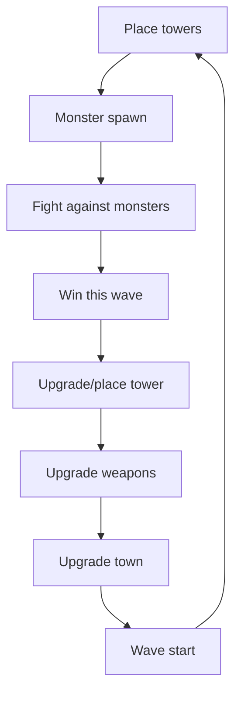
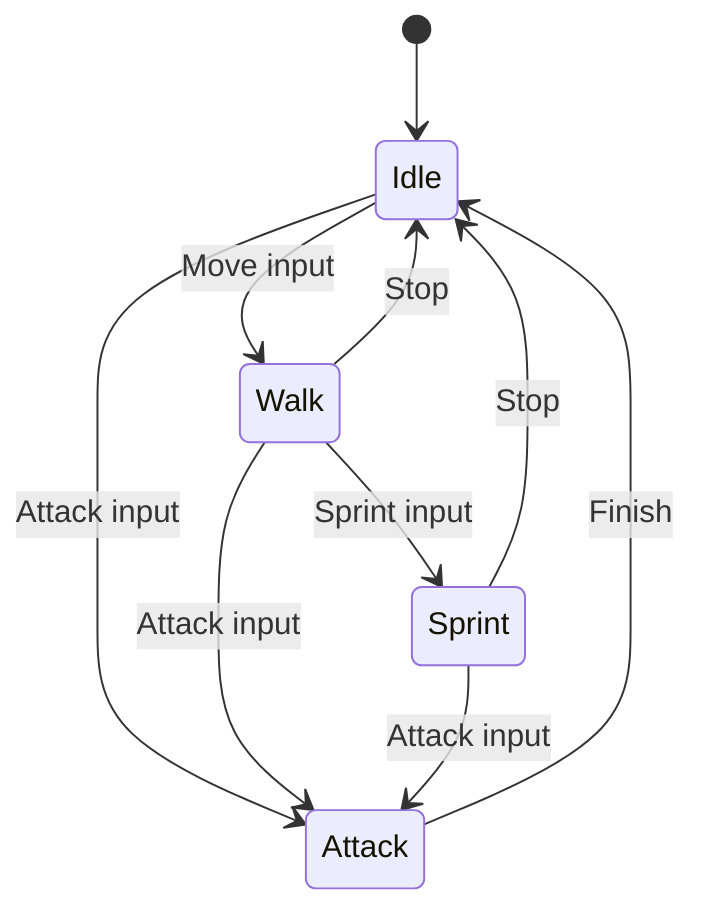
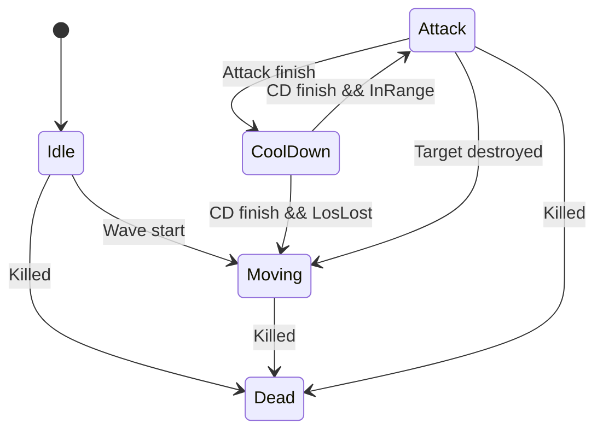
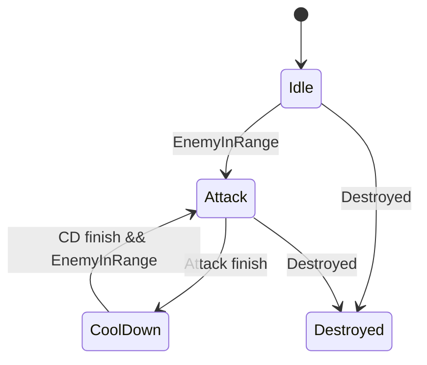

 

# The Long Path
### CISC 486
#### Group 14

## Overview
The Long Path is a 3D tower defense game. You play as a member of the town guard. You can place different defense towers on the only path towards the town to stop monsters from reaching the town, and can also fight the monsters by yourself. In multiplayer, everyone can join your session to build defenses and fight against monsters on the path.

## Game Type
3D Tower Defense, Action and Co-op multiplayer game.

## Core Gameplay
Player controls a character to place defense towers along side the only path to the town. When monster spawns, defense tower will attack monsters, and player can jump into the path and fight the monsters as well. Player will get gold coin reward for killing monsters, and gold coins can be used to upgrade a tower, build new towers, upgrade town to get more coin on killing a monster, and upgrade player weapons.

## Ped Setup

### Player numerical settings
| Type | HP | Attack |Speed|
|-|-|-|-|
|Player|Infinity|10|10|

### Monsters numerical settings
|Name| Monster type | HP | Attack |Defend|Speed|
|-|-|-|-|-|-|
|Slime|Basic|1|1|1|2|
|Goblins|Basic|50|10|10|15|

---

## AI Plan
We show a diagram for each ped in game with their FSM and decision making.

### Player

### Monsters

### Towers

---

## Multiplayer Plan
Mode: LAN Co-op

Setup: 
- Player can join another player's session, and will play as another town guard member.
- Player cannot cause damage to other players.
- All players can build and upgrade towers, and will sync across all players.

Synchronizations: 
- Player, monsters, towers will be synced from host player to other players in the same session.
- Game time synced with host player game time.

## Scripted Event

### SEventPlayerJoined
Fired when a player joins the host session. Host will receive a notification.

### SEventWavePrepare
Different types of monsters will spawn randomly on the starting point of the path with random species and types.

### SEventWaveStart
Monsters spawned in `SEventWavePrepare` event will start moving on the path towards the town.

### SEventWaveEnd
All monsters in current wave is cleared. Player will have some time (at lease 60 seconds) to prepare for the next wave.

### SEventWaveFailed
Town lost all of its HP, game over.

## Environment
A fantastical world where a small human settlement lies in a large boundless forest and grasslands. Mountains are used to surround the playable world. Invisible walls are used on map edges to prevent players from crossing boundaries.

The path to the town is using NavMesh baking for pathfinding.

The town has some medieval style buildings including apartments, houses, bar, guild and an upgradable gate as the last defense structure.

Daytime, dawn/dust, night skyboxes will be used to simulate time passing.

## Controls
| Key | Action|
|-|-|
|W|Move forward|
|A|Move left|
|S|Move back|
|D|Move right|
|Space|Jump|
|E|Interact|
|Shift + WASD|Sprint|
|Esc|Game Options (+Pause in single player)|

## Project Setup

**Unity Version**: 2022.3.62f1

**Assets**: Unity Store and similar online asset shops to acquire free assets for background, skybox, textures, sound effects and models.

**Version Control**: GitHub will be used for version control and possible CI/CD operations.

## Team Members and Roles
| Name | Roles | Responsibilities|
|-|-|-|
| Xinyu Liu | Leader, Developer | Game coding, Final decision making, PR review|
| Jerry Zhang | Developer, Artist | Game coding, PR review|
| Yiting Ma | Developer, Repository Manager | Game coding, PR review, Branch management|
