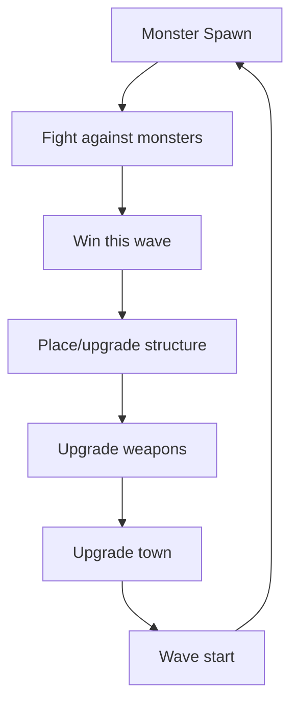
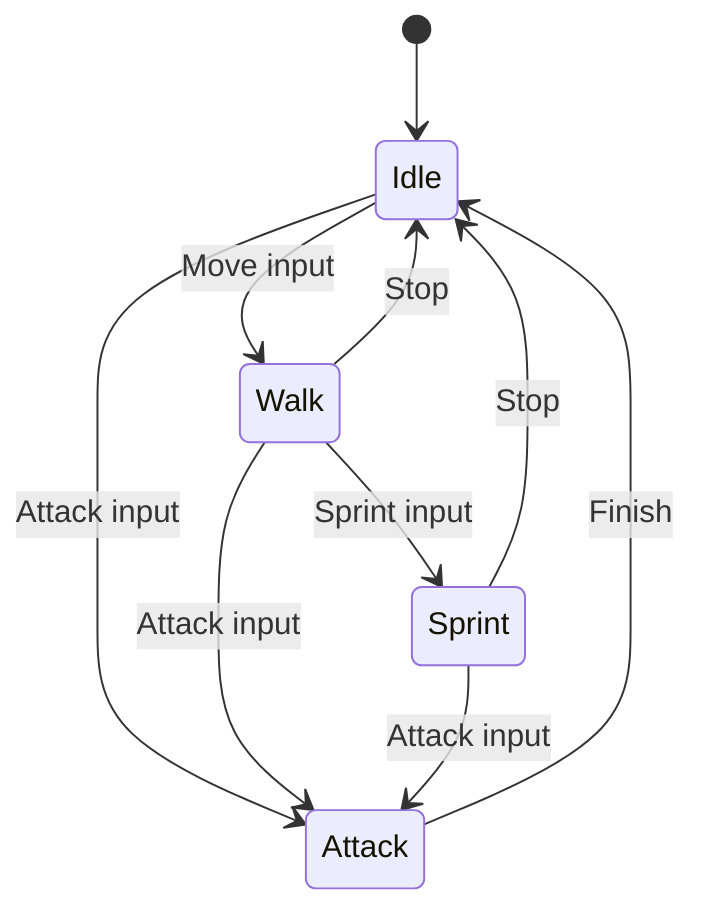
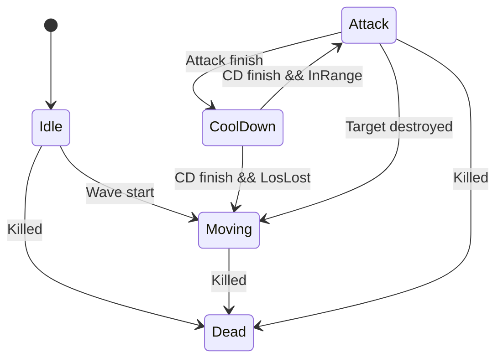
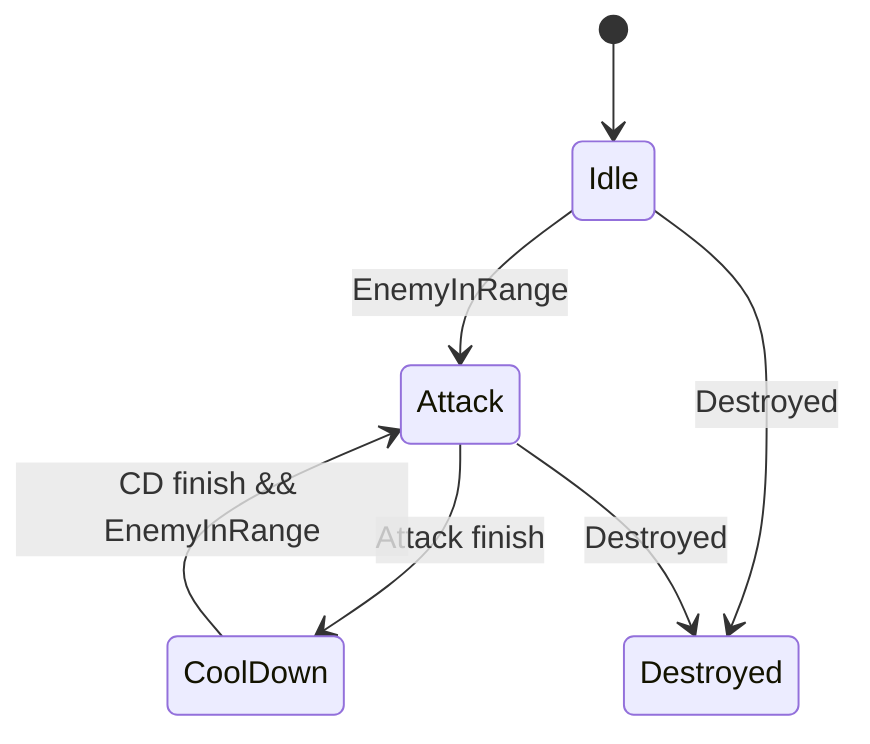

 

# Castle Champions
### CISC 486
#### Group 14

## Overview
Castle Champions is a 3D tower defense and action game. You play as a member of the town guard. You can place different defense defensive structures on the only path towards the town to stop monsters from reaching the town, and can also jump in and fight the monsters by yourself. In multiplayer, everyone can join your session to build defenses and fight against monsters on the path.

## Game Type
3D Tower Defense and Action Game.

## Core Gameplay
Player controls a character to place defense defensive structures along side the only path to the town. When monster spawns, defense structures will attack monsters, and player can jump into the path and fight the monsters as well. Player will get gold coin reward for killing monsters, and gold coins can be used to upgrade a defense structure, build new defensive structures, upgrade town to get more coin on killing a monster, and upgrade player weapons.

## Ped Setup

### Player numerical settings
| Type | HP | Attack |Speed|
|-|-|-|-|
|Player|Infinity|10|10|

### Monsters numerical settings
| Monster type | HP | Attack |Defend|Speed|
|-|-|-|-|-|
|Basic|1-25|1-10|1-10|1-10|
|Intermediate|50-100|10-50|10-50|10-20|
|Advanced|100-200|50-100|50-100|30|
---

## AI Plan
We show a diagram for each ped in game with their FSM and decision making.

### Player

### Monsters

### Defensive structures & Town Gate

---

## Multiplayer Plan
Mode: LAN Co-op

Setup: 
- Player can join another player's session, and will play as another town guard member.
- Player cannot cause damage to other players.
- All players can build and upgrade defensive structures, and will sync across all players.

Synchronizations: 
- Player, monsters, defensive structures and town will be synced with their HP, position, level from host player to other players in the same session.
- Game time synced with host player game time.
- All scripted events will be synced to all players.

## Scripted Event

### Earth Quake
Fired randomly in a random wave.

All monsters, defensive structures and town receives random HP damage.

### Town Self Upgrade
Fired at the winning of every 5 wave.

The town will upgrade 1 level by itself.

### Tax Received
Fired at the winning of every 5 wave.

The town revenue agency has collected all tax return forms and provided you some funds for defending the town.

## Environment
A fantastical world where a small human settlement lies in a large boundless forest and grasslands. Mountains are used to surround the playable world. Invisible walls are used on map edges to prevent players from crossing boundaries.

A path lies in the forest and leads towards the only town.

The town has some medieval style buildings including apartments, houses, bar, guild and an upgradable gate as the last defense structure.

Daytime, dawn/dust, night skyboxes will be used to simulate time passing.

## Controls
| Key | Action|
|-|-|
|W|Move forward|
|A|Move left|
|S|Move back|
|D|Move right|
|Space|Jump|
|E|Interact|
|N|Next Wave|
|Shift + WASD|Sprint|
|Esc|Game Options (+Pause in single player)|

## Project Setup

**Unity Version**: 2022.3.62f1

**Assets**: Unity Store and similar online asset shops to acquire free assets for background, skybox, textures, sound effects, animations and models.

**Version Control**: GitHub will be used for version control and possible CI/CD operations.

**Development Style**: GitHub Projects will be used to create and distribute tasks to each team members.

## Team Members and Roles
| Name | Roles | Responsibilities|
|-|-|-|
| Xinyu Liu | Leader, Developer | Game coding, Final decision making, PR review|
| Jerry Zhang | Developer, Artist | Game coding, PR review|
| Yiting Ma | Developer, Repository Manager | Game coding, PR review, Branch management|
